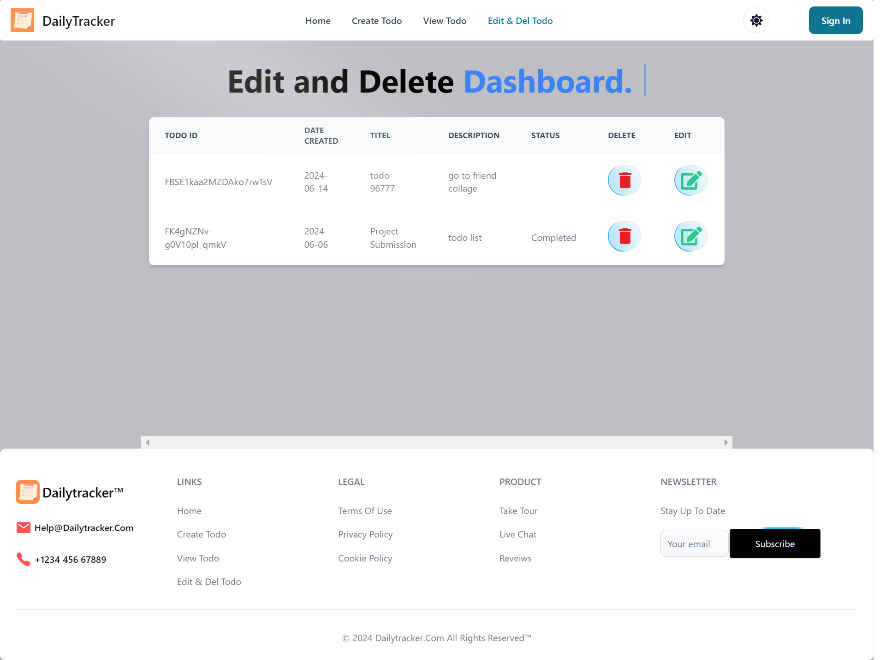

# Todo App

Welcome to the Todo App! This application allows you to manage your tasks efficiently with an easy-to-use interface. Create, update, view, and delete your todos effortlessly.


---

---

---

---

---

## Features

- **Create Todo**: Add new tasks to your todo list with a title, description, and due date.
- **View Todos**: See all your tasks at a glance, with options to edit or delete them.
- **Update Todo**: Modify existing tasks easily.
- **Delete Todo**: Remove tasks that are no longer needed.

## Tech Stack

- **React**: A JavaScript library for building user interfaces.
- **Redux Toolkit**: The official, recommended way to write Redux logic.
- **Tailwind CSS**: A utility-first CSS framework for rapid UI development.
- **Flowbite React**: Beautifully designed React components based on Tailwind CSS.

## Getting Started

### Prerequisites

Make sure you have the following installed:

- Node.js
- npm (Node Package Manager)

### Installation

1. Clone the repository:

    ```bash
    git clone https://github.com/your-username/todo-app.git
    ```

2. Navigate to the project directory:

    ```bash
    cd todo-app
    ```

3. Install dependencies:

    ```bash
    npm install
    ```

### Running the App

1. Start the development server:

    ```bash
    npm start
    ```

2. Open your browser and go to `http://localhost:3000`.

## Project Structure

```plaintext
├── public
│   ├── index.html
│   └── ...
├── src
│   ├── components
│   │   ├── ui
│   │   │   ├── label.jsx
│   │   │   ├── input.jsx
│   │   │   ├── typewriter-effect.jsx
│   │   │   ├── moving-border.jsx
│   │   │   └── ...
│   ├── data
│   │   └── data.js
│   ├── pages
│   │   ├── HomePage.jsx
│   │   ├── CreateTodo.jsx
│   │   ├── EditDelTodo.jsx
│   │   ├── UpdateTodo.jsx
│   │   └── ...
│   ├── redux
│   │   ├── store.js
│   │   ├── todo
│   │   │   └── todoSlice.js
│   │   └── ...
│   ├── utils
│   │   └── cn.js
│   ├── App.js
│   ├── index.js
│   └── ...
└── package.json
